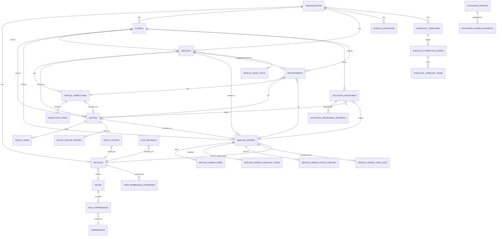

# FASE 3.0 — Inventário, Arquitetura e Planejamento Supabase

> Status: **Planejamento técnico para aprovação. Nenhum código, tabela, migration ou store foi
> alterado nesta etapa.**
> Branch: `fase-3-supabase-auth`
> Tags de referência: `fase-2-consolidada-final`, `fase-2-final-estavel`
> Data: 2026-06-13
> Complementa: [docs/ARCHITECTURE.md](ARCHITECTURE.md) (schema v1.1, escrito antes da
> implementação das Fases 1-2) e [DECISIONS.md](../DECISIONS.md) (decisões reais tomadas durante
> as Fases 1-2, que evoluíram o modelo de dados além do que o schema v1.1 previa).

## Contexto

A Fase 2 está encerrada (ver `DECISIONS.md`, seção "Fase 2B.8.4"). O ERP está 100% funcional com
dados mockados (Zustand + `localStorage`), 25 rotas validadas, identidade visual aprovada e
versionamento de build automatizado (`Fase 2B.8.5`).

`docs/ARCHITECTURE.md` já contém, desde a v1.1 (antes de qualquer código), um desenho de schema
Postgres/Supabase bastante detalhado (seções 5 a 11) e um roadmap de fases ("Fase 0" a "Fase 13").
Esse roadmap **não é o mesmo** que a numeração real do projeto ("Fase 1", "Fase 2A/2B...", "Fase
3"). Para evitar ambiguidade, este documento trata o roadmap interno de `ARCHITECTURE.md` (Fase
0-13) como **sub-etapas da Fase 3 do projeto** e as renomeia como `Fase 3.1` a `Fase 3.13` (ver
ETAPA 8.4 — Ordem de Execução).

Como o schema v1.1 foi desenhado **antes** da implementação, o modelo mockado evoluiu (Fase 2B)
com campos e entidades que o schema ainda não cobre (ex.: `deliveryMileage`/`warrantyPeriod` na
OS, `ChecklistTemplate`, `statusHistory` em orçamentos, pagamentos granulares com
reversão/edição). A auditoria desta etapa identificou esses gaps; eles estão consolidados na
ETAPA 2 e devem ser aplicados às migrations (`supabase/migrations/0001-0010`, hoje placeholders)
durante a execução da Fase 3 — **não nesta etapa de planejamento**.

---

## ETAPA 1 — Auditoria Completa (resumo)

Lidos: `AGENTS.md`, `CLAUDE.md`, `DECISIONS.md` (658 linhas), `docs/ARCHITECTURE.md` (1723
linhas), todo `src/lib/mock-data/*.ts` (19 arquivos, ~5000 linhas), `src/stores/erp-data-store.ts`
(2457 linhas) e `src/stores/ui-store.ts`.

Achados principais:

- **Infraestrutura Supabase já presente, mas vazia**: `supabase/config.toml` configurado
  (`enable_signup=false`, senha mínima 8, realtime/storage habilitados), `src/lib/supabase/{client,server,admin,middleware}.ts`
  já existem, `supabase/migrations/0001-0010` existem como **placeholders sem SQL**,
  `supabase/seed.sql` placeholder, `src/types/database.types.ts` com `Database` vazio. Dependências
  `@supabase/supabase-js` e `@supabase/ssr` já instaladas.
- **Arquitetura de dados já desenhada** (`ARCHITECTURE.md` §5-11): multi-tenant via
  `organizations` + `organization_id` em todas as tabelas, RLS por `organization_id` via JWT claim,
  RBAC configurável (`roles`/`permissions`/`role_permissions`/`user_permission_overrides`),
  taxonomias centralizadas (`config_categories`), numeração amigável (`document_sequences`),
  timeline (`entity_events`), auditoria financeira imutável (`financial_audit_logs`), Storage com
  buckets dedicados, Edge Functions e Realtime.
- **25 rotas finais** (App Router, `src/app/(dashboard)/...`), todas validadas na Fase 2B.8.4
  (Bloco 32).
- **Identidade visual travada** (Fase 0.5): Josefin Sans, paleta navy/taupe, sidebar sempre navy,
  Shadcn/UI + Base UI, dark mode via `next-themes`. Nenhuma alteração permitida na Fase 3.
- **Modelo mockado real (Fases 1-2B)** diverge do schema v1.1 em ~15 pontos (ver ETAPA 2) —
  principalmente novidades da Fase 2B: `ChecklistTemplate`, campos de entrega/garantia da OS,
  `statusHistory` em orçamentos, pagamentos granulares (`PaymentEntry` com `stage`, `cardBrand`,
  reversão por pagamento), `journeyStage` no veículo (Pátio), `PermissionAction` com 7 ações
  (vs. 4 no schema), `UserRole`/`ModuleKey` reais.

---

## ETAPA 2 — Inventário de Banco

Para cada entidade: **tabela mock** (`src/lib/mock-data/*` + `erp-data-store.ts`), **tabela
Supabase** (conforme `ARCHITECTURE.md` §7, com ajustes), **status** e **ajustes necessários**
(consolidados da auditoria de gaps). O detalhamento completo de colunas/tipos do schema v1.1 está
em `ARCHITECTURE.md` §7; aqui documentamos apenas o **delta**.

| Entidade mock                                                                                              | Tabela Supabase (v1.1)                                                                             | Status                           | Ajustes necessários                                                                                                                                                                                                                                                                                                                                                                                                                                                                                                                                                                                                                                                                                    |
| ---------------------------------------------------------------------------------------------------------- | -------------------------------------------------------------------------------------------------- | -------------------------------- | ------------------------------------------------------------------------------------------------------------------------------------------------------------------------------------------------------------------------------------------------------------------------------------------------------------------------------------------------------------------------------------------------------------------------------------------------------------------------------------------------------------------------------------------------------------------------------------------------------------------------------------------------------------------------------------------------------ |
| `Client`                                                                                                   | `clients` (§7.3)                                                                                   | Requer ajuste                    | + `fantasy_name`, `state_registration`, `responsible_name`, `status` (ativo/inativo/bloqueado). `vehicleIds` não precisa de coluna (derivado de `vehicles.client_id`).                                                                                                                                                                                                                                                                                                                                                                                                                                                                                                                                 |
| `Vehicle`                                                                                                  | `vehicles` (§7.3) + `vehicle_shop_visits` (§7.4.2)                                                 | Requer ajuste                    | + `status`, `notes`, `journey_stage_id` e `journey_stage_updated_at` **na própria `vehicles`** (denormalizado, para o Kanban do Pátio). Unificar `year_manufacture`/`year_model` × `year` único do mock. Seed de `vehicle_journey_stage` precisa de 8 valores (faltam `aguardando_inicio` e `entregue`).                                                                                                                                                                                                                                                                                                                                                                                               |
| `Inspection`                                                                                               | `vehicle_inspections` (§7.4.1) + `inspection_items`                                                | Requer ajuste                    | `fuel_level` deve ser `smallint 0-100` (não texto/fração). `status` precisa de 3 valores (`pendente/em_andamento/concluida`, schema tem 2). `inspection_items`: `label→description`, `done→is_completed`, + `stage_name`. `damage_map` jsonb: cada item precisa `id`, enums `severity` (`leve/moderado/grave`) e `view` (5 valores) documentados.                                                                                                                                                                                                                                                                                                                                                      |
| `Quote` (Orçamento)                                                                                        | `quotes` + `quote_items` (§7.5)                                                                    | Requer ajuste                    | + tabela `quote_status_history` (mesma estrutura de `service_order_status_history` + `reason`). Seed `quote_status` precisa incluir `em_negociacao`. `quote_items.category` (texto livre) precisa de migração de dados para `category_id`/`service_id`.                                                                                                                                                                                                                                                                                                                                                                                                                                                |
| `ServiceOrder` (OS)                                                                                        | `service_orders` + itens/checklist/histórico/time_logs (§7.6)                                      | Requer ajuste                    | + `delivery_mileage` (int), `warranty_period` (int dias) — novidades Fase 2B.8.3. Seed `service_order_status` deve ter 6 valores (mock não tem "Pausada"). `service_order_checklist_items`: `label→description`, `done→is_completed`, + `stage_name`. `service_order_time_logs`: reconciliar `hours`+`date` (mock) vs `started_at`/`ended_at` (schema).                                                                                                                                                                                                                                                                                                                                                |
| `Appointment` (Agenda)                                                                                     | `appointments` (§7.4)                                                                              | Requer ajuste                    | + `inspection_id`, `quote_id`, `code` (prefixo `AGD`). Seed `appointment_type` deve ser `entrega/vistoria/retorno/atendimento/outros` (schema tem outro conjunto). `document_sequences` precisa registrar `appointment`.                                                                                                                                                                                                                                                                                                                                                                                                                                                                               |
| `ChecklistTemplate`                                                                                        | **Nova**: `checklist_templates`, `checklist_template_stages`, `checklist_template_items`           | Novo (não existe no schema v1.1) | Tabelas novas, escopadas por `organization_id`, módulo `configuracoes`. `inspection_items`/`service_order_checklist_items` ganham FK opcional para `checklist_template_items` (ou ao menos `stage_name`).                                                                                                                                                                                                                                                                                                                                                                                                                                                                                              |
| `Receivable` (Conta a Receber)                                                                             | `accounts_receivable` + nova tabela de pagamentos (§7.7)                                           | Requer ajuste                    | + `code` (prefixo `REC`). Substituir/complementar `accounts_receivable_installments` por `accounts_receivable_payments` (1 linha por `PaymentEntry`: `method, value, paid_at, card_brand, card_installments, notes, stage, created_by`) — necessário para suportar reversão/edição granular por pagamento. Status: mapear `aberto→pending`, `parcial→partially_paid`, `recebido→paid`, `cancelado→cancelled`; decidir se `overdue` é status armazenado ou calculado (mock calcula via `isOverdue()`).                                                                                                                                                                                                  |
| `Payable` (Conta a Pagar)                                                                                  | `accounts_payable` + nova tabela de pagamentos (§7.7)                                              | Requer ajuste                    | + `code` (prefixo `PAG`). Mesma tabela `accounts_payable_payments`. `supplier` (texto livre no mock, inclui "Folha de pagamento"/"Receita Federal") → `payee_name` (texto, fallback) além de `supplier_id`. `category` → `category_id` (`config_categories type='financial_category'`, 7 valores) + mapa `PAYABLE_SUPPLIER_LABEL` (label do campo por categoria — decidir: coluna extra em `config_categories` ou mapa em código). Status do mock tem só 3 valores (sem `partially_paid`) — schema (5 valores) está mais correto; alinhar lógica antes de migrar.                                                                                                                                      |
| `User` + `PermissionMatrix`                                                                                | `profiles` + `roles` + `permissions` + `role_permissions` + `user_permission_overrides` (§7.1, §8) | Requer ajuste                    | + `must_change_password` (bool) em `profiles`. `status` precisa de 3 valores (`ativo/inativo/bloqueado`, schema tem 2). `permissions.action` precisa de 7 valores (`view/create/edit/delete/approve/cancel/financial`, schema tem 4). Reconciliar módulo `usuarios` (existe no schema, não existe como módulo separado no mock — está dentro de `configuracoes`). Seed de `roles` deve ser `Administrador/Gerente/Financeiro/Operacional/Personalizado` (schema tem `Atendente/Técnico` em vez de `Operacional`/`Personalizado`).                                                                                                                                                                      |
| `Technician`                                                                                               | `profiles` (role "Técnico") **ou** tabela dedicada `technicians`                                   | Decisão pendente                 | Mock trata técnico como entidade simples (`id, name, role, active`), não como usuário com login. Decidir: (a) técnicos são `profiles` com `role_id` apontando para um role "Técnico" (exigiria criar login para cada), ou (b) manter `technicians` como tabela simples independente de `auth.users` (mais fiel ao mock). Recomenda-se (b) para v1, com migração futura para (a) se técnicos precisarem de login próprio.                                                                                                                                                                                                                                                                               |
| `EntityEvent` (timeline)                                                                                   | `entity_events` (§7.11)                                                                            | Requer ajuste                    | `entity_type` precisa de 11 valores (schema documenta 4 como exemplo): `client, vehicle, quote, service_order, inspection, receivable, payable, appointment, auth, user, settings`. `event_type` precisa de 19 valores (schema documenta 7): adicionar `updated, payment_partial, payment_cancelled, payment_reversed, payment_method_changed, installment_changed, checklist_updated, inactivated, deleted, login, password_reset, permission_changed`. Decidir destino único de `login`/`password_reset`/`permission_changed`: `entity_events` (como o mock faz) ou `audit_logs` (como `ARCHITECTURE.md` §7.8 recomenda) — recomendação: `audit_logs` para esses 3, `entity_events` para o restante. |
| `Attachment` (anexos de vistoria/orçamento/OS)                                                             | `file_metadata` (§7.14) + Storage buckets (§5.3)                                                   | Requer ajuste                    | `tag` (`antes/depois/geral`) → `attachment_type`; schema já tem `photo_before/photo_after/other` — adicionar/mapear `geral→other` ou criar `photo_general`.                                                                                                                                                                                                                                                                                                                                                                                                                                                                                                                                            |
| `companyInfo` / `documentSettings`                                                                         | `organizations.settings` (jsonb, §7.0)                                                             | Requer ajuste                    | Mock tem `CompanyInfo` (11 campos) e `DocumentSettings` (4 campos) hoje na store. Recomenda-se armazenar ambos dentro de `organizations.settings jsonb` (já previsto para "logo, cores, fuso horário etc."), com `logoUrl/signatureUrl/stampUrl` referenciando `file_metadata` em vez de URL bruta.                                                                                                                                                                                                                                                                                                                                                                                                    |
| `banks` (`BankAccount`)                                                                                    | **Nova**: `bank_accounts`                                                                          | Novo                             | Tabela simples `organization_id, bank_name, agency, account, is_active`.                                                                                                                                                                                                                                                                                                                                                                                                                                                                                                                                                                                                                               |
| `catalogs` (services/categories/costCenters/teams/cancellationReasons/refusalReasons/observationTemplates) | `config_categories` (§7.2)                                                                         | Requer ajuste                    | Seed do `type` enum precisa incluir `cost_center, team, observation_template, refusal_reason` (faltam no schema atual, que só lista `cancellation_reason` entre os "novos"). `config_categories` precisa de uma coluna **`code` (texto, imutável, definido na criação)**, distinta de `name`/`normalized_name` (editável) — é o equivalente do `StatusConfig.key` do mock e é usado por lógica de negócio (ex.: `quote_status_configs`, `service_order_status_configs`, `payment_method_configs`). Este é o ajuste estrutural mais relevante do bloco de configurações.                                                                                                                                |
| `entity-events` para auth (`login`)                                                                        | `audit_logs` (§7.8)                                                                                | Requer ajuste                    | Ver linha `EntityEvent` acima — `audit_logs.action` CHECK (`login/logout/create/update/delete`) precisa incluir `password_reset`/`permission_changed` se esses eventos forem centralizados aqui.                                                                                                                                                                                                                                                                                                                                                                                                                                                                                                       |

### Diagrama de Entidades (visão consolidada)

---

## ETAPA 3 — Estratégia de Migração

### O que permanece (sem alteração nesta fase)

- **Identidade visual** (Josefin Sans, paleta navy/taupe, Shadcn/UI + Base UI, dark mode).
- **Estrutura de rotas** (`src/app/(dashboard)/...`, 25 rotas) e navegação.
- **Componentes de UI e padrões já estabelecidos** (`DataTable`, `KanbanBoard`, `StatusBadge`,
  `KpiCard`, `EntityHeader`, hidratação via `hasHydrated`).
- **`useErpDataStore` permanece como camada de leitura/cache no cliente** durante a transição
  (ver abaixo) — não é removido de uma vez, é gradualmente substituído por dados vindos do
  Supabase via Server Components/Server Actions.

### O que será removido (ao final da Fase 3)

- `localStorage` como fonte de verdade (`zustand/persist` com `name: "erp-data-store"`).
- Todos os arquivos de dados mockados em `src/lib/mock-data/*-data.ts` e os arrays `DEFAULT_*`
  usados como estado inicial do store (os tipos/enums/labels permanecem — apenas os **dados**
  fixos são substituídos por seeds reais no banco).
- `currentUserId`/`resolveCurrentUser()` (mock de "usuário logado") — substituído por
  `auth.getUser()`/sessão real via `@supabase/ssr`.
- `setCurrentUserId()` e qualquer UI de "trocar usuário atual" (se existir).
- Geração de códigos sequenciais no cliente (`nextSequentialCode`) — substituída por
  `fn_next_document_number()` no Postgres (`document_sequences`, §7.10).

### O que será migrado

Por domínio, na ordem recomendada (ver ETAPA 8.4 para o detalhamento completo):

1. **Núcleo (Fase 3.1-3.3)**: `organizations`, `profiles`, `roles`, `permissions`,
   `role_permissions`, `user_permission_overrides`, `config_categories`, `document_sequences`,
   `checklist_templates` (+stages/items), `bank_accounts`.
2. **Cadastros (Fase 3.4)**: `clients`, `vehicles` (+ ajustes da ETAPA 2).
3. **Agenda e Vistorias (Fase 3.5-3.5.5)**: `appointments`, `vehicle_inspections` +
   `inspection_items`, `vehicle_shop_visits`.
4. **Comercial (Fase 3.6-3.7)**: `quotes` + `quote_items` + `quote_status_history`,
   `service_orders` + itens/checklist/histórico/time_logs.
5. **Financeiro (Fase 3.8)**: `accounts_receivable`/`accounts_payable` + novas tabelas de
   pagamento, `cash_flow_entries` (view).
6. **Transversais (Fase 3.9-3.11)**: Dashboard/Realtime, Relatórios (views), `entity_events` +
   `audit_logs` + `financial_audit_logs`, Storage (`file_metadata` + buckets).
7. **Encerramento (Fase 3.12-3.13)**: polimento/performance, integrações externas (fora do
   escopo do MVP da Fase 3).

### Ordem ideal da migração — princípios

- **Auth e RBAC primeiro**: nenhuma tela pode trocar de "mock" para "real" sem sessão e
  permissões reais — caso contrário, regressão de segurança.
- **Taxonomias e numeração antes dos módulos de negócio**: `config_categories` e
  `document_sequences` são dependências de `clients`, `vehicles`, `quotes`, `service_orders`,
  `accounts_*`.
- **Cadastros antes de Comercial antes de Financeiro**: respeita as FKs (`clients` →
  `vehicles` → `quotes`/`service_orders` → `accounts_receivable`).
- **Cada domínio migra em pares (schema + tela)**: a tela correspondente troca de
  `useErpDataStore` para Server Components/Server Actions **no mesmo PR** que a migration do
  domínio é aplicada — evita um período prolongado de "metade mock, metade real".
- **`entity_events`/`audit_logs` migram em paralelo com cada domínio** (cada ação real já grava
  o evento real desde o início, em vez de migrar o histórico mockado).

---

## ETAPA 4 — Supabase Auth

Já especificado em `ARCHITECTURE.md` §5.1 e confirmado nesta auditoria. Plano de execução:

| Item                   | Decisão (já documentada)                                                                     | Ação na Fase 3                                                                                            |
| ---------------------- | -------------------------------------------------------------------------------------------- | --------------------------------------------------------------------------------------------------------- |
| Login                  | Email/senha via `@supabase/ssr`, cookies httpOnly                                            | Criar `(auth)/login/page.tsx`, Server Action `signIn`                                                     |
| Logout                 | `supabase.auth.signOut()`                                                                    | Server Action `signOut`, botão no menu do usuário                                                         |
| Reset de senha         | Fluxo `resetPasswordForEmail` + página de redefinição                                        | Criar `(auth)/recuperar-senha`, `(auth)/redefinir-senha`                                                  |
| Convite de usuário     | `enable_signup=false` — usuários criados via `auth.admin.createUser` (service_role)          | Server Action em `usuarios` (admin) chama `supabase.auth.admin.createUser`, cria `profiles` linkado       |
| Confirmação por e-mail | Supabase Auth nativo (templates)                                                             | Configurar templates de e-mail no projeto Supabase (idioma pt-BR)                                         |
| Troca de senha         | `mustChangePassword` (mock) → `profiles.must_change_password` (ETAPA 2)                      | No primeiro login pós-convite, redirecionar para tela de troca obrigatória                                |
| Usuário atual          | `currentUserId`/`resolveCurrentUser` (mock) → `supabase.auth.getUser()` + join em `profiles` | Substituir `useErpDataStore(state => state.currentUserId)` por hook/Server Component que lê a sessão real |

Sem login social/anônimo (decisão já tomada — `enable_signup=false`, apenas e-mail/senha,
criação por admin).

---

## ETAPA 5 — RBAC Real

### Mapeamento de papéis (mock → Supabase `roles`)

| Mock `UserRole` | Seed `roles` recomendado                                                       | Observação                                                                        |
| --------------- | ------------------------------------------------------------------------------ | --------------------------------------------------------------------------------- |
| `administrador` | Administrador (`is_system=true`)                                               | Todas as permissões, todos os módulos                                             |
| `gerente`       | Gerente                                                                        | CRUD + approve/cancel na maioria; financeiro limitado                             |
| `financeiro`    | Financeiro                                                                     | View geral + full no módulo financeiro                                            |
| `operacional`   | Operacional                                                                    | CRUD nos módulos operacionais; sem financeiro/auditoria/configurações             |
| `personalizado` | (sem seed fixo) — `role_permissions` customizado criado ad-hoc por organização | Suportado nativamente pela tabela `roles` flexível; não requer mudança estrutural |

> **Ajuste em relação ao schema v1.1**: os seeds documentados em `ARCHITECTURE.md` §1394-1450
> usam `Atendente`/`Técnico` em vez de `Operacional`/`Personalizado`. Recomenda-se alinhar o seed
> de `roles` aos 5 papéis reais do mock (`Administrador, Gerente, Financeiro, Operacional,
Personalizado`) — `Técnico` deixa de ser um papel de **acesso** (login) e passa a ser tratado
> como registro em `technicians` (ver ETAPA 2, linha `Technician`), salvo decisão em contrário.

### Matriz de permissões (mock → Supabase `permissions`/`role_permissions`)

- **Módulos (`ModuleKey`, 11 valores no mock)**: `dashboard, clientes, veiculos, vistorias,
orcamentos, ordens_servico, agenda, financeiro, relatorios, auditoria, configuracoes`. O schema
  v1.1 lista 12 módulos (inclui `usuarios` separado). **Decisão recomendada**: manter `usuarios`
  como módulo separado no schema (mais granular, alinhado às regras especiais §8.4), e ajustar a
  UI/mock de `configuracoes` para passar a expor um sub-módulo "Usuários" com permissões próprias
  — pequena adição de UI, não estrutural.
- **Ações (`PermissionAction`, 7 valores no mock)**: `view, create, edit, delete, approve,
cancel, financial`. O schema v1.1 lista 4 (`view, create, edit, delete`). **Ação**: adicionar
  `approve`, `cancel`, `financial` ao catálogo `permissions` e seed `role_permissions` para os
  módulos relevantes (`orcamentos.approve`, `ordens_servico.cancel`, `financeiro.financial`,
  etc.), espelhando exatamente `ROLE_PERMISSION_PRESETS` do mock (`src/lib/mock-data/users.ts`).
- **Resolução efetiva**: mantém o algoritmo já documentado em §8.2 (`user_permission_overrides` →
  `role_permissions` → deny por padrão) — compatível com o mock, que já resolve permissões por
  usuário (`updateUserPermissions` para `personalizado`).
- **`scope` (`all`/`own`)**: mantém-se como estrutura preparada (já no schema), **sem
  ativação** na Fase 3 — nenhuma tela do mock depende de `scope='own'` hoje.

### Camada de frontend

- `src/lib/auth/` (já previsto) deve expor `getCurrentUser()`, `getPermissions()`,
  `hasPermission(module, action)` lendo de `profiles`/`role_permissions`/`user_permission_overrides`
  (via JWT claims `organization_id`/`role_id` injetados pelo Custom Access Token Hook, §5.1).
- O hook/helper de permissões do frontend (`usePermissions()` ou equivalente) troca a fonte de
  `useErpDataStore(state => state.users)` (mock) para a sessão real — **a API do hook permanece a
  mesma** (`hasPermission("orcamentos", "approve")`), minimizando mudanças nos componentes que já
  consomem permissões.

---

## ETAPA 6 — Storage

Já especificado em `ARCHITECTURE.md` §5.3. Buckets confirmados e mapeamento com o mock:

| Bucket                            | Conteúdo mock equivalente                                             | Observação                                                                                                                                                                                                                                  |
| --------------------------------- | --------------------------------------------------------------------- | ------------------------------------------------------------------------------------------------------------------------------------------------------------------------------------------------------------------------------------------- |
| `avatars`                         | `User.photoUrl`                                                       | Avatar do usuário (`profiles.avatar_url`)                                                                                                                                                                                                   |
| `vehicle-photos`                  | `Inspection.photos`, `ServiceOrder.photos` (tag `antes/depois/geral`) | `file_metadata.attachment_type` — mapear `geral→other`                                                                                                                                                                                      |
| `vehicle-documents`               | (novo — não existe no mock hoje)                                      | CRLV, laudos, etc. — preparado para uso futuro                                                                                                                                                                                              |
| `service-order-attachments`       | `ServiceOrder.photos` adicionais/laudos                               | —                                                                                                                                                                                                                                           |
| `quote-attachments`               | `Quote.attachments`                                                   | —                                                                                                                                                                                                                                           |
| `generated-pdfs`                  | PDFs gerados hoje via `jspdf` no cliente (orçamento, OS, garantia)    | Decisão: manter geração client-side (jsPDF já funcional, sem custo de Edge Function) **ou** migrar para Edge Function + Storage; recomenda-se **manter client-side na Fase 3** (não bloqueia migração de dados) e revisar em fase posterior |
| `company-assets` (novo, sugerido) | `CompanyInfo.logoUrl/signatureUrl/stampUrl`                           | Ver ETAPA 2 — substitui URLs brutas em `organizations.settings`                                                                                                                                                                             |

Políticas (RLS de Storage): por `organization_id` (path prefixado, ex.:
`vehicle-photos/{organization_id}/{vehicle_id}/...`), igual ao padrão de RLS das tabelas (§7.9).

---

## ETAPA 7 — Segurança

Já especificado em `ARCHITECTURE.md` §7.8, §7.9 e §7.13. Confirmações e pontos de atenção desta
auditoria:

- **RLS**: padrão `organization_id = fn_current_org_id()` (via JWT claim, sem subquery) em todas
  as tabelas de negócio — já documentado em §7.9, sem alterações necessárias.
- **Policies**: por módulo, usando `fn_has_permission(module, action)` (RBAC da ETAPA 5) —
  precisa ser estendida para os 3 novos `action` (`approve/cancel/financial`).
- **Multiusuário**: cada `profiles` pertence a uma `organization_id`; v1 opera com 1 organização
  semeada (single-tenant funcional, multi-tenant estrutural) — consistente com o mock atual
  (uma única "empresa").
- **Auditoria**:
  - `entity_events` (timeline por entidade, user-facing) — expandir `entity_type`/`event_type`
    conforme ETAPA 2.
  - `audit_logs` (login/logout/CRUD genérico) — expandir `action` CHECK se `password_reset` e
    `permission_changed` forem centralizados aqui (recomendado).
  - `financial_audit_logs` (hash-chain, imutável) — cobre pagamentos/reversões; a nova tabela de
    pagamentos (`accounts_receivable_payments`/`accounts_payable_payments`, ETAPA 2) deve
    disparar entradas aqui em cada `payment_received/payment_reversed/payment_cancelled`.
- **Backups**: gerenciado pelo Supabase (Point-in-Time Recovery no plano adequado) — sem ação de
  código; documentar no runbook operacional (fora do escopo de código desta fase).
- **Soft delete**: `deleted_at` universal (§7.9) — substitui os `delete*` do mock que hoje
  removem o item do array. Os botões "Excluir" existentes devem passar a setar `deleted_at`
  (RLS já filtra `deleted_at IS NULL` por padrão).

---

## ETAPA 8 — Entregáveis

### 8.1 PRD da Fase 3

**Objetivo**: substituir a camada de dados mockada (Zustand + localStorage) por Supabase
(Postgres + Auth + Storage + Realtime), preservando 100% da UX, identidade visual e
funcionalidades já entregues na Fase 2, e fechando os gaps identificados na ETAPA 2 entre o
modelo mockado real e o schema v1.1 originalmente desenhado.

**Critérios de sucesso**:

1. Login/logout reais funcionando; nenhuma tela acessível sem sessão válida.
2. Todas as 25 rotas da Fase 2 operam com dados reais do Postgres (sem regressão funcional ou
   visual).
3. RBAC real aplicado (UI esconde/bloqueia ações conforme `role_permissions`/`user_permission_overrides`,
   reforçado por RLS no banco — defesa em profundidade).
4. Numeração de documentos (`CLI-`, `VEI-`, `ORC-`, `OS-`, `VIS-`, `AGD-`, `REC-`, `PAG-`) gerada
   pelo Postgres, sem colisões.
5. Upload/exibição de anexos via Storage (fotos de vistoria/OS, avatares).
6. Auditoria (`entity_events`, `audit_logs`, `financial_audit_logs`) gravando eventos reais desde
   o primeiro dia de cada domínio migrado.
7. `npm run typecheck`, `npm run lint`, `npm run build` passando a cada etapa.

**Fora do escopo da Fase 3**: Realtime avançado/materialized views (Fase 3.9), Relatórios
avançados (Fase 3.10) além do necessário para paridade com a Fase 2, integrações externas (Fase
3.13 — WhatsApp, NF-e, gateways de pagamento), geração de PDF server-side.

### 8.2 Arquitetura do banco

A arquitetura de banco "aprovada" para a Fase 3 é `docs/ARCHITECTURE.md` §6-11 **com os ajustes
listados na ETAPA 2** (tabela de inventário). Antes de escrever as migrations, os ajustes da
ETAPA 2 devem ser incorporados a `ARCHITECTURE.md` §7 (atualização incremental, seção por seção,
à medida que cada domínio é migrado — evita reescrever 1700 linhas de uma vez e mantém o
documento sincronizado com o código real).

### 8.3 Diagrama de entidades

Ver diagrama Mermaid na ETAPA 2 (visão consolidada de alto nível). O diagrama detalhado por
domínio (colunas completas) permanece em `ARCHITECTURE.md` §7, a ser atualizado por domínio
conforme a ordem de execução abaixo.

### 8.4 Plano de migração e ordem de execução

Renomeando o roadmap de `ARCHITECTURE.md` §11 (Fase 0-13) como sub-etapas da Fase 3 do projeto:

| Sub-etapa      | Conteúdo (ARCHITECTURE.md §11)                                                       | Migrations                                                                                                                                            | Telas/Stores afetadas                                        | Pré-requisitos                             |
| -------------- | ------------------------------------------------------------------------------------ | ----------------------------------------------------------------------------------------------------------------------------------------------------- | ------------------------------------------------------------ | ------------------------------------------ |
| **Fase 3.1**   | Fundação do projeto (extensões, helpers genéricos)                                   | `0001_init_extensions.sql`                                                                                                                            | —                                                            | —                                          |
| **Fase 3.2**   | Multi-tenant + Auth + Núcleo RBAC                                                    | `0002_rbac.sql` (+ `organizations`, `profiles`)                                                                                                       | `(auth)/login`, `(auth)/recuperar-senha`, layout autenticado | 3.1                                        |
| **Fase 3.3**   | Módulo de Usuários + Configurações/Taxonomias/Numeração + Checklist Templates (novo) | `0003_taxonomies.sql` (expandido com `config_categories.code`, novos `type`, `checklist_templates*`, `bank_accounts`, `document_sequences` expandido) | `usuarios`, `configuracoes` (todas as abas)                  | 3.2                                        |
| **Fase 3.4**   | Clientes e Veículos (+ ajustes ETAPA 2: status, fantasy*name, journey_stage*\*)      | `0004_clients_vehicles.sql`                                                                                                                           | `clientes/*`, `veiculos/*`                                   | 3.3                                        |
| **Fase 3.5**   | Agenda (+ `inspection_id`/`quote_id`/`code`)                                         | `0005_agenda.sql`                                                                                                                                     | `agenda`                                                     | 3.4                                        |
| **Fase 3.5.5** | Vistoria e Jornada do Veículo / Pátio                                                | `0005_agenda.sql` ou novo `0005b_inspections.sql` (`vehicle_inspections`, `inspection_items`, `vehicle_shop_visits`)                                  | `vistorias/*`, `patio`                                       | 3.4                                        |
| **Fase 3.6**   | Orçamentos (+ `quote_status_history`)                                                | `0006_quotes.sql`                                                                                                                                     | `orcamentos/*`                                               | 3.4, 3.5.5                                 |
| **Fase 3.7**   | Ordens de Serviço (+ `delivery_mileage`/`warranty_period`)                           | `0007_service_orders.sql`                                                                                                                             | `ordens-servico/*`                                           | 3.6                                        |
| **Fase 3.8**   | Financeiro (+ tabelas de pagamento granulares, `code` em receivable/payable)         | `0008_financial.sql`                                                                                                                                  | `financeiro/*`                                               | 3.6, 3.7                                   |
| **Fase 3.9**   | Dashboard, Realtime, Views Materializadas                                            | (views/funções, sem nova migration numerada)                                                                                                          | `(dashboard)/page.tsx`                                       | 3.4-3.8                                    |
| **Fase 3.10**  | Relatórios                                                                           | (views)                                                                                                                                               | `relatorios`                                                 | 3.4-3.8                                    |
| **Fase 3.11**  | Auditoria (`entity_events`/`audit_logs`/`financial_audit_logs` expandidos)           | `0009_audit.sql`                                                                                                                                      | `auditoria`                                                  | transversal, evolui junto com cada domínio |
| **Fase 3.12**  | Polimento, performance, lançamento                                                   | `0010_storage_policies.sql` + revisão geral                                                                                                           | —                                                            | todas anteriores                           |
| **Fase 3.13**  | Integrações externas (pós-MVP)                                                       | —                                                                                                                                                     | —                                                            | fora do escopo                             |

**Regra de execução**: cada sub-etapa só é considerada concluída quando (a) a migration SQL está
aplicada, (b) a(s) tela(s) correspondente(s) consomem dados reais (sem mock), (c)
`entity_events`/`audit_logs` do domínio gravam eventos reais, e (d) `npm run typecheck && npm run
lint && npm run build` passam. Isso evita o estado "metade mock, metade real" mencionado na
ETAPA 3.

---

## Pendências para decisão antes do início da execução

Estas decisões impactam o desenho das migrations e devem ser confirmadas antes da Fase 3.1:

1. **`config_categories.code`** (coluna imutável, ETAPA 2) — adicionar agora evita retrabalho em
   todas as tabelas que referenciam taxonomias por chave estável.
2. **Módulo `usuarios`** separado de `configuracoes` no RBAC (ETAPA 5) — afeta o seed de
   `permissions`/`role_permissions` e a UI de "Usuários".
3. **Technicians como `profiles` vs. tabela própria** (ETAPA 2) — afeta `service_orders.assigned_to`
   e `service_order_time_logs.user_id`.
4. **Pagamentos granulares**: nova tabela `accounts_receivable_payments`/`accounts_payable_payments`
   vs. reaproveitar `*_installments` (ETAPA 2, item Financeiro) — decisão estrutural antes da
   Fase 3.8, mas não bloqueia 3.1-3.7.
5. **Destino de eventos de autenticação** (`login`/`password_reset`/`permission_changed`):
   `entity_events` (como o mock) vs. `audit_logs` (recomendação desta auditoria) — afeta 3.2 e
   3.11.

Nenhuma dessas pendências bloqueia o início da Fase 3.1 (fundação/extensões), que não depende de
nenhuma das decisões acima.
